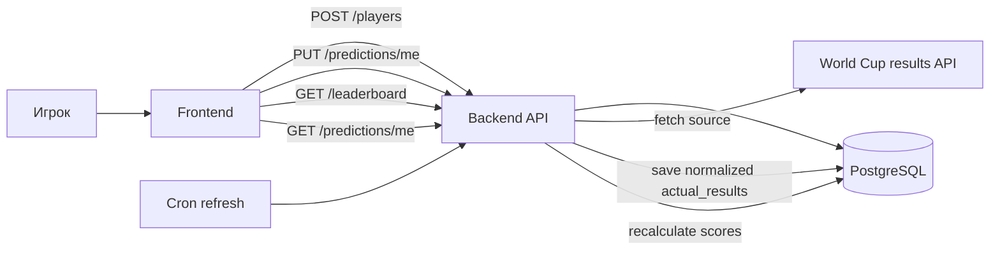

# Backend-архитектура Chexx WC 2026 Predictor

## Цель backend

Backend должен стать единым источником истины для конкурса:

- регистрировать игроков;
- сохранять прогнозы;
- хранить фактические результаты турнира;
- пересчитывать очки;
- отдавать live-таблицу;
- защищать прогнозы от правок после дедлайна.

Текущий фронт может остаться статическим. Он будет отправлять данные в API и получать обратно сохраненный прогноз, live-таблицу и статус турнира.

## Рекомендуемый стек

Для MVP:

- Runtime: `Node.js`.
- API framework: `Fastify`.
- Database: `PostgreSQL`.
- ORM/query layer: `Kysely` или `Prisma`.
- Deploy: `Render` или `Vercel`.
- Cron: внешний cron, Render Cron Job или Vercel Cron.

Причина выбора: текущая игровая логика уже написана на JavaScript, поэтому правила турнира и scoring можно вынести в общий модуль и использовать и на фронте, и на backend.

## Реализованный backend MVP

В проект уже добавлена первая рабочая backend-версия без внешних зависимостей:

- `backend/server.mjs` — HTTP API и статическая раздача фронта.
- `backend/src/tournament.mjs` — серверные правила турнира, валидация прогноза, scoring и нормализация внешнего источника.
- `backend/src/store.mjs` — JSON-хранилище.
- `backend/data/db.json` — локальная база данных, создается автоматически при первом запуске.
- `backend/scripts/smoke-test.mjs` — проверка API: создает игрока, сохраняет прогноз, кладет моковый результат и проверяет 119 очков.

Запуск:

```bash
npm run backend
```

После запуска лендинг и API доступны на одном origin:

```text
http://localhost:8787
```

Проверка:

```bash
npm run check
npm run backend:smoke
```

Эта версия подходит для локальной разработки и проверки бизнес-логики. Для реального конкурса JSON-хранилище нужно заменить на PostgreSQL, сохранив API-контракты и scoring-модуль.

## Границы ответственности

### Frontend

Frontend отвечает за:

- ввод имени;
- удобный выбор групп, третьих мест и победителей плей-офф;
- локальный черновик до сохранения;
- отправку финального прогноза;
- отображение live-таблицы и сохраненного выбора.

Frontend не должен:

- быть источником истины по сохраненным прогнозам;
- сам пересчитывать официальные очки конкурса;
- хранить прогнозы всех игроков в `localStorage`;
- читать внешний источник результатов напрямую в production.

### Backend

Backend отвечает за:

- создание игрока;
- валидацию прогноза;
- сохранение прогноза;
- запрет изменений после дедлайна;
- загрузку фактических результатов из внешнего источника;
- нормализацию результатов;
- расчет очков;
- выдачу live-таблицы.

## Модель данных

### `players`

Игрок конкурса.

```sql
create table players (
  id uuid primary key,
  display_name text not null,
  access_token_hash text not null,
  created_at timestamptz not null default now(),
  updated_at timestamptz not null default now()
);
```

`access_token_hash` нужен для простого входа без полноценной авторизации. После создания игрока frontend получает приватный token и хранит его локально. По нему backend понимает, кто сохраняет или читает прогноз.

### `predictions`

Сохраненный прогноз игрока.

```sql
create table predictions (
  id uuid primary key,
  player_id uuid not null references players(id),
  tournament_code text not null default 'wc2026',
  status text not null check (status in ('draft', 'submitted', 'locked')),
  groups_json jsonb not null,
  third_place_json jsonb not null,
  picks_json jsonb not null,
  champion_team_id text,
  submitted_at timestamptz,
  created_at timestamptz not null default now(),
  updated_at timestamptz not null default now(),
  unique (player_id, tournament_code)
);
```

`groups_json`:

```json
{
  "A": ["mexico", "south-korea", "czechia", "south-africa"],
  "B": ["canada", "switzerland", "qatar", "bosnia"]
}
```

`third_place_json` хранит именно команды, а не только буквы групп:

```json
[
  { "groupId": "A", "teamId": "czechia" },
  { "groupId": "B", "teamId": "qatar" }
]
```

`picks_json`:

```json
{
  "m73": "south-korea",
  "r16-89": "brazil",
  "qf-97": "france",
  "sf-101": "argentina",
  "m103": "spain",
  "m104": "brazil"
}
```

### `actual_results`

Нормализованный результат турнира.

```sql
create table actual_results (
  id uuid primary key,
  tournament_code text not null default 'wc2026',
  source text not null,
  groups_json jsonb not null default '{}'::jsonb,
  third_place_json jsonb not null default '[]'::jsonb,
  picks_json jsonb not null default '{}'::jsonb,
  raw_payload_json jsonb,
  updated_at timestamptz not null default now()
);
```

`third_place_json` тоже хранит команды:

```json
[
  { "groupId": "A", "teamId": "czechia" },
  { "groupId": "B", "teamId": "qatar" }
]
```

### `score_snapshots`

Кеш расчета очков. Для маленького конкурса можно считать очки на лету, но snapshot полезен для live-таблицы.

```sql
create table score_snapshots (
  player_id uuid primary key references players(id),
  tournament_code text not null default 'wc2026',
  total_points integer not null default 0,
  group_points integer not null default 0,
  third_place_points integer not null default 0,
  playoff_points integer not null default 0,
  breakdown_json jsonb not null default '{}'::jsonb,
  recalculated_at timestamptz not null default now()
);
```

## API

### `POST /api/players`

Создает игрока или возвращает существующего по token.

Request:

```json
{
  "displayName": "Артем"
}
```

Response:

```json
{
  "player": {
    "id": "uuid",
    "displayName": "Артем"
  },
  "accessToken": "private-token"
}
```

### `GET /api/me`

Возвращает игрока и его сохраненный прогноз.

Auth: `Authorization: Bearer <accessToken>`.

Response:

```json
{
  "player": {
    "id": "uuid",
    "displayName": "Артем"
  },
  "prediction": null,
  "canEditPrediction": true
}
```

### `PUT /api/predictions/me`

Создает или заменяет прогноз текущего игрока до дедлайна.

Auth: `Authorization: Bearer <accessToken>`.

Request:

```json
{
  "groups": {
    "A": ["mexico", "south-korea", "czechia", "south-africa"]
  },
  "thirdPlaces": [
    { "groupId": "A", "teamId": "czechia" }
  ],
  "picks": {
    "m73": "south-korea",
    "m104": "brazil"
  },
  "championTeamId": "brazil"
}
```

Backend валидирует:

- есть 12 групп;
- в каждой группе 4 уникальные команды из этой группы;
- выбрано ровно 8 третьих мест;
- каждое третье место соответствует команде, которая в прогнозе стоит третьей в своей группе;
- сетка плей-офф валидна по регламенту;
- championTeamId равен победителю финала `m104`;
- дедлайн еще не наступил.

Response:

```json
{
  "prediction": {
    "status": "submitted",
    "championTeamId": "brazil",
    "submittedAt": "2026-06-10T12:00:00.000Z"
  }
}
```

### `GET /api/predictions/me`

Возвращает сохраненный прогноз пользователя.

### `GET /api/leaderboard`

Возвращает live-таблицу.

Response:

```json
{
  "updatedAt": "2026-07-20T21:00:00.000Z",
  "source": "worldcup26.ir",
  "rows": [
    {
      "rank": 1,
      "playerId": "uuid",
      "displayName": "Артем",
      "championTeamId": "brazil",
      "totalPoints": 42,
      "groupPoints": 18,
      "thirdPlacePoints": 8,
      "playoffPoints": 16
    }
  ]
}
```

### `GET /api/actual-results`

Возвращает нормализованные фактические результаты. Нужен для отладки и live-экрана.

### `POST /api/admin/results/refresh`

Закрытый endpoint для ручного обновления фактических результатов.

Auth: admin token.

## Поток данных



## Расчет очков

Правила считаются на backend в модуле `scoring`.

Вход:

- `prediction`;
- `actualResults`;
- tournament config: группы, команды, матчи, scoring rules.

Выход:

```json
{
  "total": 119,
  "groups": 36,
  "thirdPlaces": 16,
  "playoff": 67,
  "breakdown": {
    "groups": [
      { "groupId": "A", "exactPlaces": 4, "points": 3 }
    ],
    "thirdPlaces": [
      { "teamId": "czechia", "hit": true, "points": 2 }
    ],
    "playoff": [
      { "matchId": "m104", "teamId": "brazil", "hit": true, "points": 10 }
    ]
  }
}
```

Важно: за лучшие третьи места сравниваются `teamId`, а не `groupId`.

## Обновление фактических результатов

Backend по cron делает:

1. Читает внешний источник.
2. Сохраняет raw payload в `actual_results.raw_payload_json`.
3. Нормализует группы, лучшие третьи места и победителей матчей.
4. Обновляет `actual_results`.
5. Пересчитывает `score_snapshots` для всех submitted/locked прогнозов.

Рекомендуемая частота:

- до турнира: 1 раз в сутки;
- во время матчей: каждые 5-10 минут;
- после матчей: ручная проверка admin endpoint.

## Дедлайны и защита от правок

Минимальная логика:

- до дедлайна игрок может перезаписывать прогноз;
- после дедлайна `PUT /api/predictions/me` возвращает `403`;
- backend переводит submitted прогнозы в `locked`;
- live-таблица показывает только `submitted` и `locked`;
- admin может скрыть подозрительный прогноз или пересчитать очки.

Для MVP можно не делать полноценный login/password. Достаточно token, который создается при первом вводе имени и хранится в браузере. Для корпоративного запуска можно позже добавить SSO или вход по email.

## Структура backend-кода

```text
backend/
  src/
    server.ts
    config.ts
    db/
      client.ts
      migrations/
    modules/
      players/
        players.routes.ts
        players.service.ts
      predictions/
        predictions.routes.ts
        predictions.service.ts
        predictions.validation.ts
      leaderboard/
        leaderboard.routes.ts
        leaderboard.service.ts
      results/
        results.routes.ts
        results.service.ts
        source-worldcup26.ts
      scoring/
        scoring.service.ts
        scoring.test.ts
      tournament/
        wc2026.config.ts
  package.json
```

`wc2026.config.ts` должен содержать:

- список групп;
- команды;
- схему 1/16;
- правила распределения третьих мест;
- scoring table.

## Переход с текущего фронта

Шаги миграции:

1. Оставить `localStorage` только для черновика текущего пользователя.
2. При вводе имени вызвать `POST /api/players`.
3. При сохранении прогноза вызвать `PUT /api/predictions/me`.
4. Live-таблицу читать из `GET /api/leaderboard`.
5. Сохраненный выбор читать из `GET /api/predictions/me`.
6. Убрать прямой вызов `worldcup26.ir` из браузера.
7. Перенести `calculateLiveScore()` и регламент сетки в backend-модуль.

## MVP-версия

Минимум для первого рабочего backend:

- `POST /api/players`
- `PUT /api/predictions/me`
- `GET /api/predictions/me`
- `GET /api/leaderboard`
- `POST /api/admin/results/refresh`
- таблицы `players`, `predictions`, `actual_results`
- расчет очков на лету или простой `score_snapshots`

Этого достаточно, чтобы провести конкурс среди коллег без ручного экспорта данных.
